# Screen Shots of the Mockup Process
## Started with layout.
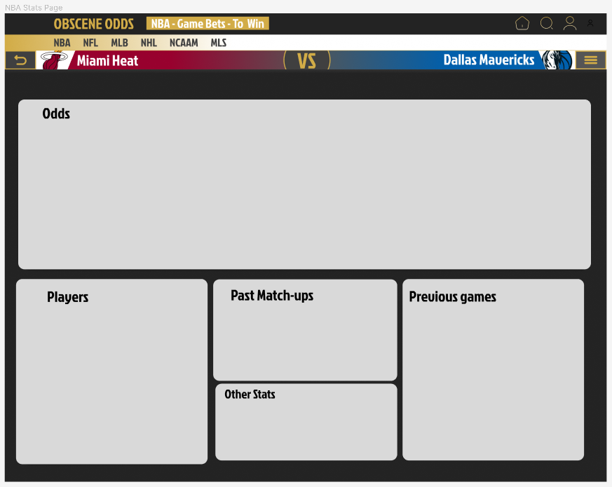

## Mocked up the Odds widget and added it to the main page.

### Odds widget components
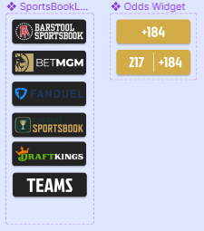
### Odds widget final
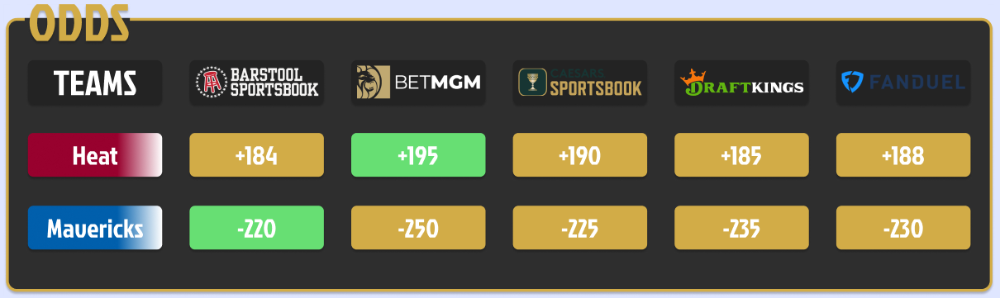
### Odds widget added
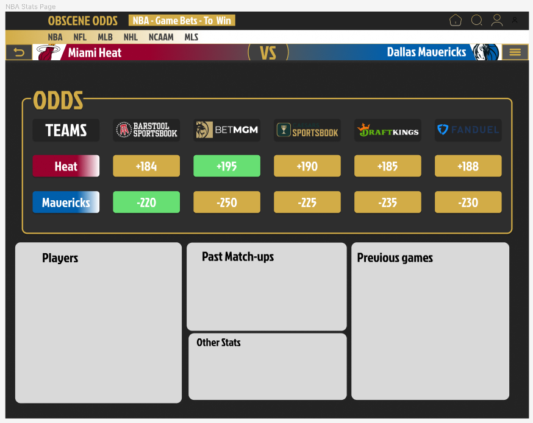

## Mocked up the Previous Games widget and added it to the main page.

### Previous Games widget components
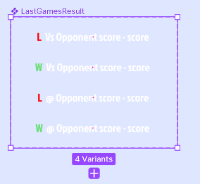
### Previous Game widget
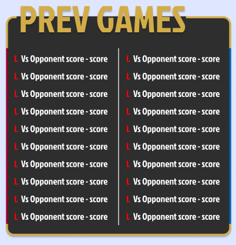
### Previous Games widget added
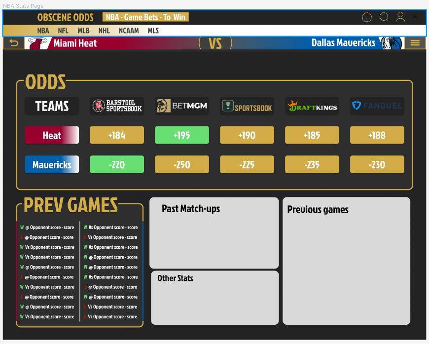

## Mocked up the Players widget and added it to the main page.

### Players widget components
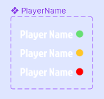
### Players widget
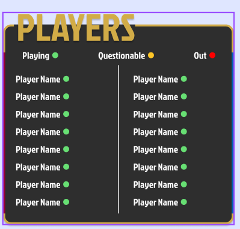
### Players widget added
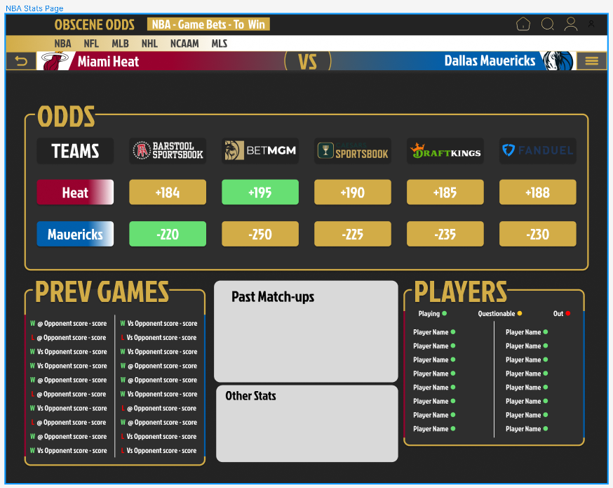

## Mocked up the Matchups widget and added it to the main page.

### Matchups widget components
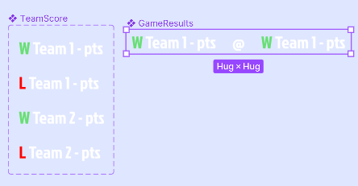
### Matchups widget
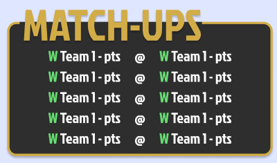
### Matchups widget added
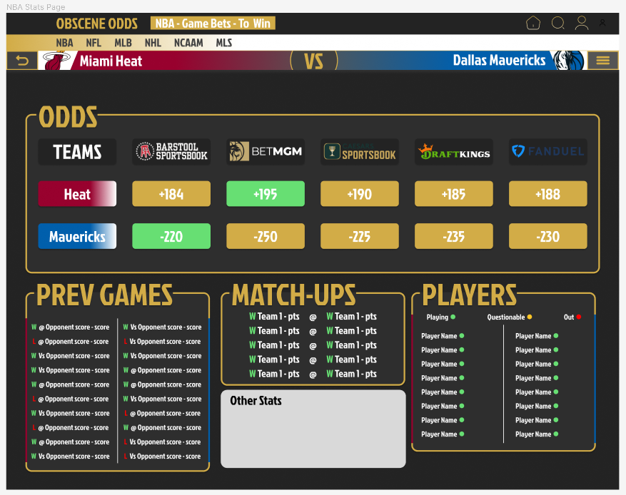

## Mocked up the Other Stats widget and added it to the main page.

### Other Stats widget components
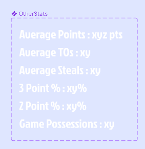
### Other Stats widget
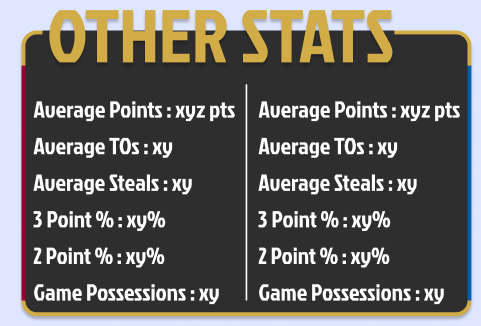
### Other Stats widget added
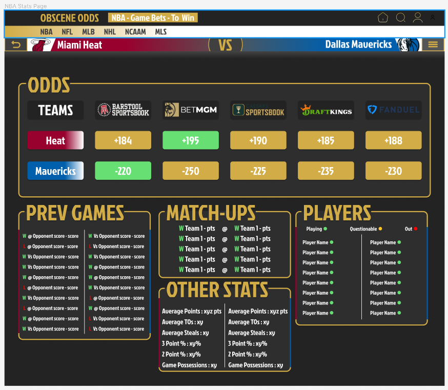

